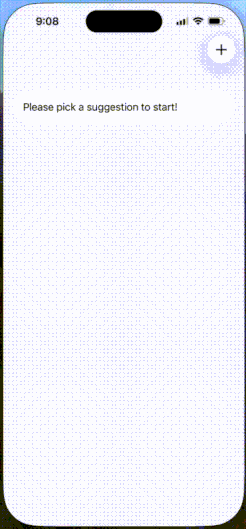

# SwiftUI_JournalingSuggestions

A demo on using Journaling Suggestions framework to allows the user to select personal events 
such as such as a place they visited, a person they connected with, a photo in their library, a song that they play repeatedly, a workout, 
or some reflection prompts provided by the system.

For more details, please refer to my article: [SwiftUI: Journaling Suggestions]()
